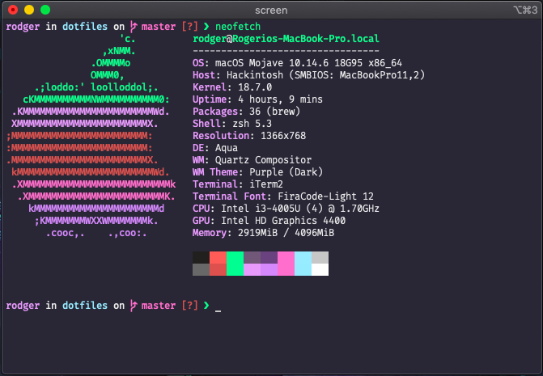
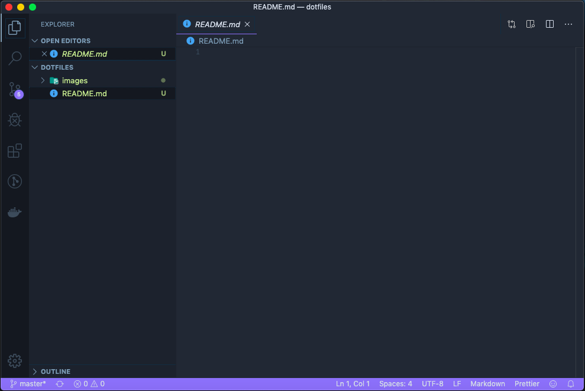

  
  <h1>~/dotfiles ...</h1>
  

    <blockquote align="center">...and my dev environment <strong>configs</strong>!</blockquote>
  

  Shared with ❤︎ by
    <a href="https://github.com/rodgeraraujo">Rogério Araújo</a>
  

## 💻 ~/dotfiles
This is are my environment config and dotfiles.

## 🚀 Terminal (iTerm 2) + neofetch

My palette is [Dracula](https://draculatheme.com/iterm/) with some modifications!

## 🎆 VSCode editor

The theme used on my editor is the [<strong>Supernova</strong>](https://marketplace.visualstudio.com/items?itemName=MikeBell.supernova-color-theme).

## 👽 Author

[Rogério Araújo](https://github.com/rodgeraraujo)